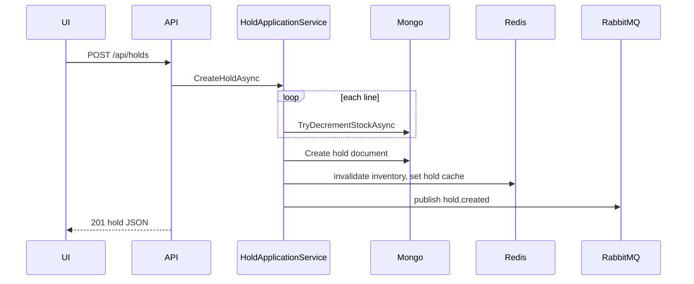
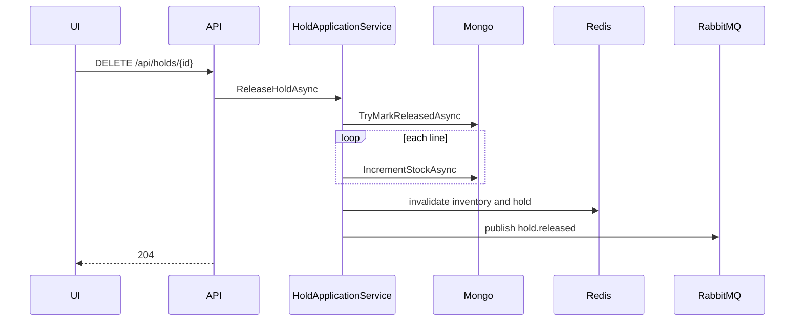

# Architecture

## Layering

```text
InventoryHold.WebApi        → HTTP, JSON, DI composition
InventoryHold.Domain        → HoldApplicationService, entities, repository/cache/publisher abstractions
InventoryHold.Infrastructure → MongoDB, Redis, RabbitMQ implementations
InventoryHold.Contracts     → DTOs and integration event payloads (shared API + messaging shape)
InventoryHold.UnitTests     → Service tests with mocks
```

## Sequence: create hold



## Sequence: release hold



## Expiry

When a hold is still `Active` in Mongo but `ExpiresAt <= UtcNow`, the next **GET** (by id or via **list**) transitions it to `Expired`, sets `ExpiredEventPublished`, emits **hold.expired** once, and updates cache.

## Frontend

- **Vite** dev server proxies `/api` to the API for local dev.
- **Docker:** one **`app`** container — the Vite build is published into **`wwwroot`** and **Kestrel** serves static files plus **`/api/*`** on the same port.
- **State:** TanStack Query invalidates `inventory` and `holds` after create/release so the UI stays in sync without a full page reload.
